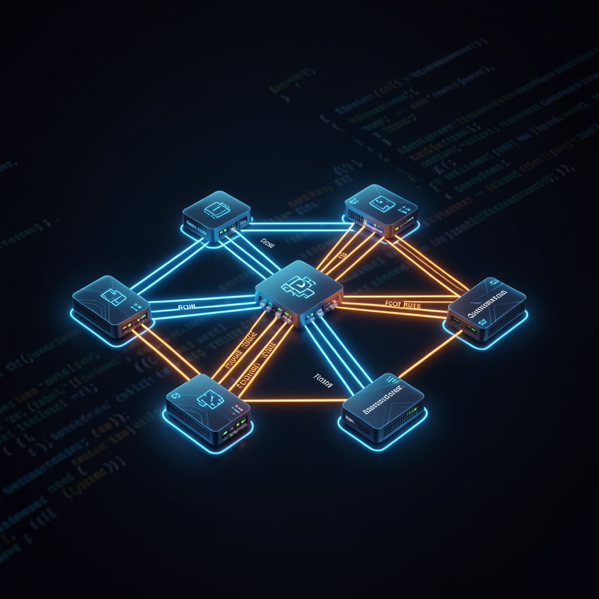

<p align="center">
  
  
  
</p>


# SDN FL Anomaly Detector: Human-in-the-Loop (HITL) Security

A four-tool security system for Software-Defined Networks that combines
federated machine learning, poisoning defense, control-plane attack simulation,
and human-centered threat response.

---

## Video Presentation

Watch my videos:

> 🎥 [To be added](https://youtu.be/--piwDzTGkY)  
> 📚 with [Copy-and-Paste commands](https://1drv.ms/w/c/0b9ef4570f82165e/IQAq_i-HaHxiR68uXXBLw-1_AXld-KmNJMdVscRaK2X4Nhg?e=iAmRyj)

> 🎥 [Visual Studio Code](https://youtu.be/MVw3uOJcdss)
> I use Visual Studio Code for my dashboard. I attach GitHub Codespaces, and add-ins as shown in the video, which includes CoPilot AI usage.

> Note: Tools 1 and 2, built in Ubuntu 20.04, have not been tested. I added Tool 3 as part of Ubuntu 22.04 for DigitalOcean along with all requirements.
> When installing, some 20.04 library errors result. So, I installed different library versions to account for the Ubuntu 22.04 installation.

---

## Table of contents

1. [Problem Statement](#problem-statement)
2. [Project Overview](#project-overview)
3. [Repository Structure](#repository-structure)
4. [Network Topology](#network-topology)
5. [DigitalOcean Demo](#digitalOcean-droplet)
6. [Installation](#installation)
7. [Tool 1: Federated Anomaly Detection](#tool-1--federated-anomaly-detection)
8. [Tool 2: Byzantine-robust Poisoning Defense](#tool-2--byzantine-robust-poisoning-defense)
9. [Tool 3: OpenFlow FlowMod Injection](#tool-3--openflow-flowmod-injection)
10. [Tool 4: Human-in-the-Loop Security Dashboard](#tool-4--human-in-the-loop-security-dashboard)
11. [Full pipeline reference](#full-pipeline-reference)
12. [Makefile targets](#makefile-targets)
13. [Configuration](#configuration)
14. [Running tests](#running-tests)
15. [Limitations and known issues](#limitations-and-known-issues)

---

## Problem Statement

Modern Software-Defined Networks (SDNs) have some great features, such as controlling traffic and being programmable from a central location. However, when it comes to security, things are not so clear. The systems in place to detect anomalies in these networks are mostly automated or use ML and not very transparent. They can identify potential issues, but they don't provide much explanation. For instance, they might give you a raw anomaly score or a binary flag, but that is it. We see statistics but we need to know what it means. For example, we could see an anomaly score of -0.5697. We cannot tell what this means or what are the common problems that the score represents. What kind of attack is it? You're left wondering what to do next. These systems, including some that use federated learning (FL), like Tools 1 and 2, are good at spotting unusual patterns, but they don't make it easy for humans to understand what's happening. A network administrator might look at a Z-score of +1,900 and have no idea what it means or what action to take. The output from these systems is mathematically accurate, but it's not designed to be fully interpreted. This can make it hard for network administrators to respond effectively to potential security threats. What's needed is a way to make these anomaly detection systems more transparent and easier to understand. This involves providing more information about the potential security issues that arise. A host could be generating suspicious traffic. By making this information more accessible, network administrators can respond more quickly and effectively to security threats, and help protect their networks.

Lack of information creates a usability problem. Research consistently shows that security operators who do not understand why an alert was generated are less likely to address it correctly. They may dismiss genuine threats as false positives, approve mitigations they do not understand, or delay action while seeking additional data that the system does not provide. In federated SDN environments where attacks can occur across the network in milliseconds, decision delays have operational cost.

Another problem that arises by the automation assumption embedded in most detection systems. When anomaly detection feeds directly into automated mitigation, i.e., installing DROP rules, isolating hosts, or rerouting traffic, network operators are not in control over their own networks. A model that flags legitimate iperf3 traffic as a DDoS attack, or that blocks a host based on a miscalibrated threshold, causes harm without any human checkpoint to catch the error. Full automation trades operator trust for speed, often at the cost of both.

Current methods do not seem to do a good job of showing how sure they are about something. For example, if a system called Isolation Forest says a flow is anomalous and gives it a rank of 4 out of 250, and says it's 98.4% sure. The system does not tell the operator if that's really true, what makes it think that, or how it compares to other warnings. Without this information, operators of the system cannot get a sense of when to trust data flows and when to override it, and they cannot get better at responding to warnings over time. They need to know more about what's going on behind the scenes to make good decisions.

Tool 4 is created to provide more of a human touch. It places a human operator in the middle of the detection and enforcement process. Instead of automatically responding to every anomaly, the system takes the raw model outputs and translates them into easy-to-understand explanations. These explanations identify the likely attack pattern, describe which network features have deviated from the norm, and provide a recommendation with three options. The operator then reviews this explanation, makes a decision, and only after that does the system put an OpenFlow DROP rule in place on the target switch. Every decision made is logged, including a timestamp, the operator's identity, the method used, and the cookie of the installed rule. Tool 4 addresses the gap between what anomaly detection systems produce and what human operators need to feel confident in their actions. By doing so, Tool 4 ensures that human operators are in the loop, making informed decisions based on clear and concise information. This approach improves the overall effectiveness of the system and also provides transparency. With Tool 4, operators can trust that they have the information they need to make the right decisions.

### Existing Approaches

#### Federated Learning Security Systems

FL approaches to SDN security, including the system demonstrated in Tools 1 and 2 of this project, distribute model training across multiple network clients to preserve privacy while building a global anomaly detector. These systems address the data sharing problem in multi-organizational SDN environments but inherit the interpretability limitations of the underlying machine learning models. The federated global model produces anomaly scores that are no more interpretable than those of a centrally trained model, and the federated architecture provides no mechanism for operator review before enforcement.

#### Explainable AI Security Tools

Some research systems use special techniques to make AI more understandable as related to security alerts. These techniques, like LIME and SHAP, show which input features have the biggest impact on a particular anomaly score. But the problem is, they produce results that are hard to understand unless you are versed in data science. They provide values such as feature weights and Shapley values. However, these are not understandable. Because of this, these techniques are not widely used in real-world security systems, especially when it comes to SDN security. What seems to be absent is a system that allows humans to work alonside AI - to make decisions and take actions based on the alerts it generates. This includes integrating with SDN and keeping a record of everything that happens. Think of it like this: when the AI flags something as suspicious, it would be great if it could explain why it made that decision, and then give the human operator options for what to do next. This would make it easier for people to trust the AI and work with it to keep the network secure. But now, that is not happening. The techniques we have are like black boxes, i.e., they make predictions, but they don't tell us how they got there, or what we should do.

#### Rule-Based Intrusion Detection Systems

Traditional systems for detecting intrusions, like Snort and Suricata, compare network traffic to a list of known attack patterns. If a packet or flow matches a pattern, the system sends an alert or automatically blocks the traffic. These systems are reliable when it comes to known attacks. But, they are not good at detecting new or "zero-day" attacks. Additionally, they do not provide explanations other than a flow matched a rule.  When they take automatic action, operators do not get a chance to review the decision before it happens. In SDN environments, Snort and Suricata can be integrated with the controller to automatically install flow rules. This is for automation only. For instance, when a system like Snort identifies a threat, it generates an alert and may block the traffic. It does not provide any detailed information about why that traffic was suspicious. This makes it difficult for operators to understand what's happening and how to make informed decisions about the responses. These systems are automated, take action quickly, and do not allow operators a chance to review or override the decision. Blocking legitimate traffic or creating security holes can occur.

#### Machine Learning Anomaly Detectors

Some systems, like FlowWatch and Kitsune, use models to learn what normal traffic looks like. They flag anything that doesn't fit that pattern. These systems are better than older ones because they can catch new attacks. The information they provide, e.g. anomaly scores or binary flags, is hard to understand. For example, if a system gives a score of -0.58, it doesn't tell us what caused that score. It does not tell us its confidence or what we should do about it. These systems operate automatically by putting in rules to stop problems or sending alerts - without anyone's approval. They use models like Isolation Forest and autoencoder-based approaches to make their decisions. Operators will require expertise in order to interpret the results.

#### SIEM Platforms

Security Information and Event Management (SIEM) platforms such as Splunk, IBM QRadar, and Microsoft Sentinel collect alerts from multiple sources and present them in a unified dashboard. While these platforms provide visibility, they do not provide explanations. They also operate outside the SDN control plane such that mitigation actions needs to happen manually - through a separate interface. 

#### SDN Security Controllers

Projects such as ONOS, with Intent-based security policies, and OpenDaylight, with security applications, provide SDN  security enforcement. These systems install flow rules when it detects an attack. These systems are designed for automated policy enforcement and not human decision. The operator could define policies in advance with the controller enforcing them but without real-time human review. This approach works well for documented predictable threats but cannot handle novel or ambiguous attacks where operator judgment is needed.  

---

## Project Overview

| Tool | What it does | Key files |
|------|-------------|-----------|
| **Tool 1** | Train Isolation Forest models per switch client, federate them into one global anomaly detector | `src/local_train.py`, `src/federated.py`, `src/detect.py` |
| **Tool 2** | Defend federated aggregation against model poisoning using Z-score sanitization | `src/sanitizer.py`, `sdn_mininet/poisoned_host.py` |
| **Tool 3** | Demonstrate a control-plane attack: sniff the unencrypted OpenFlow channel, inject a rogue FlowMod DROP rule | `sdn_mininet/injector.py` |
| **Tool 4** | Human-in-the-Loop dashboard: explain why a flow is suspicious, let the operator review it, then install a defensive DROP rule | `src/hitl.py`, `src/explainer.py`, `sdn_mininet/mitigator.py`, `dashboard/` |

The project runs on **Ubuntu 20.04** with **Python 3.10**, **Mininet 2.3.1b4**, and **Ryu 4.34**.

---

## Repository Structure

```

├── cli.py  # Root CLI 
├── Makefile  # Reproducibility
├── requirements.txt
├── install.sh  # Ubuntu 20.04 setup
├── install-22.04.sh  # Ubuntu 22.04 setup
├── config/
│   ├── fed_config.yaml  # FL simulation parameters (Tools 1–2)
│   └── hitl_config.yaml  # HITL thresholds and demo scenarios (Tool 4)
├── src/
│   ├── __init__.py
│   ├── features.py  # Flow feature extraction and preprocessing
│   ├── local_train.py  # For Isolation Forest training (Tool 1)
│   ├── federated.py  # Federated aggregation (Tools 1–2)
│   ├── detect.py  # Anomaly scoring engine (Tool 1)
│   ├── evaluate.py  # Metrics & confusion matrix (Tools 1–2)
│   ├── sanitizer.py  # Z-score poisoning defense (Tool 2)
│   ├── hitl.py  # Alert dataclass and AlertQueue (Tool 4)
│   └── explainer.py  # Human-readable alert text (Tool 4)
├── sdn_mininet/
│   ├── topology.py  # Mininet topology (three switches, seven hosts)
│   ├── ryu_collector.py  # Ryu controller & flow stats CSV writer
│   ├── poisoned_host.py  # Tool 2 attack: upload metric times 100
│   ├── injector.py  # Tool 3 attack injection
│   ├── label_window.py  # Post-run CSV labeling by timestamp
│   └── mitigator.py  # Tool 4: install & remove DROP rules
├── dashboard/
│   ├── app.py  # Flask REST API server (port 5000)
│   ├── templates/index.html  # Operator web UI
│   └── static/dashboard.js  # Live polling, decision flow, keyboard nav
├── scripts/
│   └── generate_data.py  # Synthetic flow data generator
├── data/  # Generated CSVs
├── models/  # Trained model bundles 
├── results/  # Evaluation output & audit logs
├── tests/
│   └── test_sanitizer.py  # Tool 2 unit tests
└── docs/ 
```
GitHub MCV assisted  

---

## Initial Network Topology


draw.io assisted

### Hosts and Switches

| Host | Role | Switch | IP |
|------|------|--------|----|
| h1 | Benign client (HTTP, iperf3) | s1 | 10.0.0.1 |
| h2 | HTTP server (port 80 + 8080) | s1 | 10.0.0.2 |
| h3 | Benign client (UDP, HTTP) | s2 | 10.0.0.3 |
| h4 | DDoS attacker (hping3 SYN flood) | s2 | 10.0.0.4 |
| h5 | Benign client (ping keepalive) | s3 | 10.0.0.5 |
| h6 | Port scanner / FL model poisoner | s3 | 10.0.0.6 |
| h7 | FlowMod injector (Tool 3) | s1 | 10.0.0.7 |

---

## System Overview


draw.io assisted

### Planned System Flow


draw.io assisted

---

## DigitalOcean Droplet

I trained the Federated Learning model for 10 minutes. This seemed to be ample for my project. 
There will be  anomalies that may appear without an attack. My program is designed to find the top 5% of anomalies so they may pop up. 
In addition, 10 minutes is not guaranteed to produce all types of Iperf traffic that normally flows through my network. 

In this droplet, I use Ubuntu 22.04. All dependencies are already installed and should not produce any errors. The following are the commands for the demonstration.
I follow these commands with the shutdown or clean up cycle. I start my demonstration with some clearing out the queue and CSV files that are used for training and detection.
I do this if a person who shares the droplet, does not properly clean up the application. If not properly shutdown, the app will behave unpredictably and may produce errors.

### Prepare the environment

Open up three terminals. In my video, I open up three Powershells version 7.6.4. If using Ubuntu, open up 3 CLIs. ssh into all three using the same username and IP address. 
I will provide this in the discussion. 

#### Step 1. Start up 3 terminals

In all three terminals, use the same username and IP address to ssh into DigitalOcean.

```bash
ssh reviewer@165.227.25.254
```

Click `yes` for the fingerprint.

#### Step 2. Start Ryu Controller (Terminal 1)

```bash
cd ~/reviewer-dashboard
sudo mn -c
ryu-manager sdn_mininet/ryu_collector.py ryu.app.ofctl_rest --observe-links
```

#### Step 3. Start Mininet (Terminal 2)

```bash
cd ~/reviewer-dashboard
sudo python3 sdn_mininet/topology.py
```

#### Step 4. Start the Dashboard (Terminal 3)

```bash
cd ~/reviewer-dashboard
sudo systemctl restart hitl-dashboard
sleep 3
curl -s http://localhost:5000/api/health
```

#### Step 5. Open the Dashboard in your browser

Open Chrome, Edge, or your choice of browser and enter the Url:
```url
http://165.227.28.254:5000
```

### Run the App

In these commands, I insert them to clear any block rules a user may entered and not cleard.

#### Step 1. Clear old data flows and the queue

- In Terminal 3, clear any old block rules:

```bash
sudo ovs-ofctl del-flows s1 "cookie=0xfeedfacecafe0004/-1" -O OpenFlow13
```

- clear the forwarding rules between h1 <-> h2

```bash
sudo ovs-ofctl del-flows s1 "dl_src=00:00:00:00:01:01,dl_dst=00:00:00:00:01:02" -O OpenFlow13
sudo ovs-ofctl del-flows s1 "dl_src=00:00:00:00:01:02,dl_dst=00:00:00:00:01:01" -O OpenFlow13
```

- clear out the alert queue so the new attack shows

```bash
curl -s -X POST http://localhost:5000/api/alerts/clear
```

#### Launch the Attack (Terminal 2 - mininet prompt)

```bash
h1 hping3 -S --flood -p 80 h2
```

- To stop the attack:
`Ctrl + C` in Terminal 2, at the mininet prompt

#### Wait for scan and check dashboard

```bash
sleep 35
curl -s http://localhost:5000/api/health
```

Clicking the `scan` button in the Dashboard will prompt a scan.

#### Block the attack

In the dashboard, look for the alert with src ip of 10.0.0.1, dst_port 80, dpid 1. Click `Approve` to block the attack.

#### Prove the Block worked

- Use the `Verify Rules` button in the Dashboard to see the inserted rule.
- Optionally, use Terminal 3 to see the inserted rule:

```bash
sudo ovs-ofctl dump-flows s1 -O OpenFlow13 | grep -i feedface
```

To see any new alerts and clear out the old queue, I find this helpful:
```bash
curl -s -X POST http://localhost:5000/api/alerts/clear
```

- Test if h1 can send http traffic to h2 in Terminal 2 at the mininet prompt:

```bash
h1 curl --max-time 3 http://10.0.0.2/
```

#### Unblock the traffic

- There should be a 5 minute timer that resets the path and unblocks it. 
- To unblock it between runs or resume the flow

```bash
sudo ovs-ofctl del-flows s1 "cookie=0xfeedfacecafe0004/-1" -O OpenFlow13
```

### Shut down 

Terminal 2, mininet prompt

```bash
exit
```

Terminal 2:

```bash
sudo mn -c
```

- clear the alert queue:

```bash
curl -s -X POST http://localhost:5000/api/alerts/clear
```

- Stop the dashboard (optional - okay to leave on)

```bash
sudo systemctl stop hitl-dashboard
```

---

## Installation

### Prerequisites

Ubuntu 20.04 (native or VM). The lab does not work inside Docker for the live
Mininet mode because Mininet requires kernel namespaces.

### Setup
1. Import the IoTGoat .vdi into VirtualBox; set its NIC to Internal Network "iotlab"
2. Set Kali's NIC to an Internal Network, "iotlab"
3. Ubuntu needs a NIC set on "iotlab"
4. Configure static IPs: IoTGoat 192.168.100.2/24, Kali 192.168.200.3/24
5. Run `make iot-bridge` after topology.py is already running

### Automated setup

```bash
chmod +x install.sh
./install.sh
```

This installs Open vSwitch, Mininet from source (Python 3), the Ryu SDN
framework, hping3, nmap, iperf3, and all Python dependencies.

### Manual Python dependencies

```bash
pip3 install -r requirements.txt
```

Tool 4 requires Flask (not included in the base Ryu environment):

```bash
pip3 install flask flask-cors
```

### Verify the install

```bash
# Mininet
sudo python3 -c "import mininet; print('Mininet OK')"

# Ryu
ryu-manager --version

# Python packages
python3 -c "import sklearn, flask, scapy; print('All OK')"
```

---

## Tool 1: Federated Anomaly Detection

Tool 1 trains an Isolation Forest on each switch's flow data independently,
then federates the models into a single global anomaly detector without sharing
raw traffic. Detection runs against the federated model rather than any
individual client's data.

### Offline demo (no Mininet needed)

```bash
# 1. Generate synthetic flow data for three clients
python3 cli.py generate-data --n-clients 3 --n-benign 2000 --n-attack 400

# 2. Train one local model per client
python3 cli.py train --data data/client1.csv --client-id client1 --out models/client1.pkl
python3 cli.py train --data data/client2.csv --client-id client2 --out models/client2.pkl
python3 cli.py train --data data/client3.csv --client-id client3 --out models/client3.pkl

# 3. Federate into one global model
python3 cli.py federate --models "models/client*.pkl" --out models/global.pkl

# 4. Score new flows
python3 cli.py detect --model models/global.pkl --data data/new_flows.csv --top-n 10

# 5. Evaluate against labeled test data
python3 cli.py evaluate --model models/global.pkl \
    --detections results/detections.csv \
    --data data/test_labeled.csv \
    --local-models "models/client*.pkl" \
    --out results/
```

Or run the entire pipeline in one command:

```bash
make all
```

### Live Mininet mode

```bash
# Terminal 1: Ryu controller
ryu-manager sdn_mininet/ryu_collector.py --observe-links

# Terminal 2: Mininet topology (benign traffic only)
sudo python3 sdn_mininet/topology.py --time 120

# Terminal 3: watch CSVs grow
watch -n 5 wc -l data/live_client*.csv

# After collection — train on live data
python3 cli.py train --data data/live_client1.csv --client-id live_c1 --out models/live_c1.pkl
python3 cli.py train --data data/live_client2.csv --client-id live_c2 --out models/live_c2.pkl
python3 cli.py train --data data/live_client3.csv --client-id live_c3 --out models/live_c3.pkl
python3 cli.py federate --models "models/live_*.pkl" --out models/live_global.pkl
python3 cli.py detect   --model models/live_global.pkl --data data/live_client2.csv --top-n 10
```

### How it works

The Ryu controller polls every switch every 5 seconds for flow statistics
using `OFPFlowStatsRequest`. Each switch's statistics are written to
`data/live_clientN.csv`. The Isolation Forest learns the normal traffic
distribution for each client independently (no labels used during training).
At inference time, flows are scored using the federated ensemble: each
client's model scores the flow, and the scores are averaged. Flows with
scores below the consensus threshold are flagged as anomalous.

---

## Tool 2: Byzantine-robust Poisoning Defense

Tool 2 defends the federated aggregation step against model poisoning attacks.
A compromised host (h6) uploads a grossly inflated metric designed to push the
global model away from the legitimate consensus. The Z-score sanitizer detects
and removes the outlier before aggregation.

### Run the poisoning demo

```bash
# Terminal 1: Ryu controller
ryu-manager sdn_mininet/ryu_collector.py --observe-links

# Terminal 2: Mininet topology
sudo python3 sdn_mininet/topology.py --time 120 --attack

# Terminal 3: legitimate clients upload healthy metrics
python3 sdn_mininet/poisoned_host.py --host h1 --no-poison --controller-ip 127.0.0.1
python3 sdn_mininet/poisoned_host.py --host h2 --no-poison --controller-ip 127.0.0.1

# Terminal 4: attacker uploads poisoned metric (100× multiplier)
python3 sdn_mininet/poisoned_host.py --host h6 --multiplier 100 --controller-ip 127.0.0.1

# Trigger aggregation — watch sanitizer reject h6
curl http://127.0.0.1:8080/fl/aggregate
```

### Standalone demo (no Mininet)

```bash
python3 cli.py demo
```

### Multi-round FL simulation

```bash
python3 cli.py simulate-fl --config config/fed_config.yaml --poison h6:100
```

### Z-score sanitizer

The sanitizer computes the group mean and standard deviation across all client
uploads, then calculates the Z-score for each client. Clients with
`|Z| > threshold` (default 1.5 for small groups, 2.0 for larger) are rejected
before aggregation. The threshold is configurable in `config/fed_config.yaml`
and via the `Z_THRESHOLD` environment variable.

---

## Tool 3: OpenFlow FlowMod Injection

Tool 3 demonstrates that an adversary with access to the host machine can
observe the unencrypted OpenFlow control channel and inject malicious flow
rules directly into a switch — bypassing the Ryu controller entirely.

### How the attack works

**Phase 1: Passive sniff:** `injector.py` listens on the loopback interface
for OpenFlow traffic on port 6633. When the Ryu controller sends a message to
s1, the sniffer fires.

**Phase 2: FlowMod injection:** The injector connects directly to s1's passive
OVS listener (`ptcp:6654`), performs an OpenFlow 1.3 handshake, requests
`EQUAL` role, and sends a crafted `OFPFlowMod` that drops all TCP traffic
destined for port 80 with priority 40000.

**Evasion:** The rule matches only `tcp_dst=80`. ICMP (ping) traffic is never
matched, so `h1 ping h2` continues to succeed while `h1 curl h2` times out.

### Run the attack

```bash
# Terminal 1: Ryu controller
ryu-manager sdn_mininet/ryu_collector.py --observe-links

# Terminal 2: Mininet topology with injection
sudo python3 sdn_mininet/topology.py --time 120 --inject

# Terminal 3: verify in Mininet CLI
mininet> h1 curl --max-time 3 http://10.0.0.2/   # times out (injected)
mininet> h1 ping -c 3 10.0.0.2                   # succeeds (evasion)
mininet> sh ovs-ofctl dump-flows s1 -O OpenFlow13 # shows rogue rule
```

The injected rule carries cookie `0xDEADBEEFCAFE0001` at priority 40000 and is
visible in `ovs-ofctl dump-flows`.

---

## Tool 4: Human-in-the-Loop security dashboard

Tool 4 is the human-centered security layer. It detects anomalous flows,
explains **why** each flow was flagged, presents the operator with a clear
recommendation, and waits for the operator to decide whether to block, monitor,
or ignore. No traffic is ever blocked automatically.

### Architecture


assisted by Eraser AI @ https://www.eraser.io/ai

---

### Tool 4

| File | Purpose |
|------|---------|
| `src/hitl.py` | `Alert` dataclass, `AlertQueue`, `alerts_from_detections()` |
| `src/explainer.py` | Pattern matching, human-readable explanation + recommendation |
| `sdn_mininet/mitigator.py` | Installs and removes OpenFlow DROP rules |
| `dashboard/app.py` | Flask REST API (port 5000) |
| `dashboard/templates/index.html` | Operator alert review dashboard |
| `dashboard/static/dashboard.js` | Live polling, decision flow, keyboard shortcuts |
| `config/hitl_config.yaml` | All Tool 4 thresholds, mitigation params, demo scenarios |

### Quick start (offline or no Mininet needed)

```bash
# Build the model first if you have not already
make all

# Launch the dashboard
python3 cli.py dashboard --model models/global.pkl --data data/new_flows.csv
```

Open `http://localhost:5000` in a browser. Click **⚡ Scan now** to detect
anomalies and populate the alert list. Select an alert to see its full
explanation and recommendation, then choose an action.

### Live Mininet mode

```bash
# Terminal 1
ryu-manager sdn_mininet/ryu_collector.py --observe-links

# Terminal 2
sudo python3 sdn_mininet/topology.py --time 120 --attack

# Terminal 3 dashboard reads live CSV, auto-scans every 30 s
python3 cli.py dashboard --model models/global.pkl --data data/live_client1.csv
```

### Terminal mode (no browser)

```bash
# Print alerts and prompt for each one
python3 cli.py hitl --model models/global.pkl --data data/new_flows.csv --interactive

# Auto-block all HIGH-severity alerts without prompting
python3 cli.py hitl --model models/global.pkl --data data/new_flows.csv --auto-block
```

### Demo scenarios

```bash
make demo-hitl  # DDoS from h4 (live_client2.csv)
make demo-scan  # Port scan from h6 (live_client3.csv)
make demo-inject  # FlowMod injection from h7 — shows both cookies side by side
make demo-fte  # Flow table exhaustion
make demo-baseline  # Clean traffic — no alerts expected
```

The `demo-inject` scenario automatically runs `ovs-ofctl dump-flows s1` after
the operator approves mitigation, showing both rules simultaneously:

```
cookie=0xfeedfacecafe0004  priority=30000  actions=drop   ← Tool 4 defensive
cookie=0xdeadbeefcafe0001  priority=40000  actions=drop   ← Tool 3 rogue
```

### Alerts Explained

Every alert includes:

- **Severity** -> HIGH / MEDIUM / LOW based on anomaly rank percentile
- **Confidence** -> how anomalous this flow is relative to the batch
- **Detection pattern** -> named attack type (DDoS, port scan, flow table
  exhaustion, control-plane probe) or plain-language feature description
- **Feature breakdown** -> the top 3 most anomalous features with Z-scores and
  observed-vs-baseline comparison
- **Recommendation** -> three labelled options (Approve/Block, Monitor, Ignore)
  with specific guidance based on severity, protocol, and destination port

### REST API (port 5000)

| Method | Endpoint | Description |
|--------|----------|-------------|
| `GET` | `/` | Dashboard web UI |
| `GET` | `/api/alerts` | All alerts |
| `GET` | `/api/alerts/pending` | Pending alerts only |
| `GET` | `/api/alerts/<id>` | Single alert |
| `POST` | `/api/decide` | Submit operator decision |
| `GET` | `/api/stats` | Queue summary counts |
| `GET` | `/api/mitigation/log` | Mitigation audit log |
| `GET` | `/api/mitigation/verify` | Run `ovs-ofctl` to verify installed rules |
| `POST` | `/api/scan` | Trigger immediate detection scan |
| `GET` | `/api/health` | Server health and uptime |

Example: approve an alert and trigger mitigation:

```bash
curl -X POST http://localhost:5000/api/decide \
  -H "Content-Type: application/json" \
  -d '{"alert_id": "a1b2c3d4", "decision": "approved"}'
```

### Keyboard shortcuts

| Key | Action |
|-----|--------|
| `j` / `↓` | Next alert |
| `k` / `↑` | Previous alert |
| `a` | Approve / block |
| `m` | Monitor |
| `i` | Ignore |
| `r` | Trigger scan |
| `Escape` | Close modal |
| `?` | Show keyboard help |

### Verify mitigation

```bash
make verify
# or
sudo ovs-ofctl dump-flows s1 -O OpenFlow13 | grep feedfacecafe0004
```

Tool 4 rules use cookie `0xFEEDFACECAFE0004` at priority 30000. They
self-expire after 5 minutes of idle traffic (`idle_timeout=300`). To remove a
rule manually:

```bash
curl -X POST http://localhost:5000/api/mitigation/unblock \
  -H "Content-Type: application/json" \
  -d '{"src_ip": "10.0.0.4", "dst_port": 80, "protocol": "tcp", "dpid": 2}'
```

### Audit logs

| File | Contents |
|------|----------|
| `results/mitigator.log` | Every Block / Monitor / Ignore with timestamp, source IP, method, and cookie |
| `results/hitl_audit.log` | Scan events and alert generation counts |
| `results/ryu_sanitizer.log` | Tool 2 Z-score sanitizer reports |

---

## Full pipeline reference

### All tools, live Mininet

```bash
# Setup (run once)
chmod +x install.sh && ./install.sh

# Terminal 1: Ryu controller (Tools 1, 2, 4)
ryu-manager sdn_mininet/ryu_collector.py --observe-links

# Terminal 2: Mininet topology (all attacks)
sudo python3 sdn_mininet/topology.py --time 120 --attack --inject

# Terminal 3: HITL dashboard (Tool 4)
python3 cli.py dashboard --model models/global.pkl --data data/live_client1.csv

# Terminal 4: watch flow collection
watch -n 5 wc -l data/live_client*.csv
```

### Offline pipeline (no VMs)

```bash
make all  # data → train → aggregate → detect → evaluate
make hitl  # Tool 4 terminal scan
make dashboard  # Tool 4 browser dashboard
```

---

## Ubuntu 22.04

The lab initially ran on Ubuntu 20.04 and still does. I set it up to run on Ubuntu 22.04 with Python 3.10.
Most Python packages (numpy, pandas, scikit-learn, scapy, flask) install on both. The differences, however,
are in the Mininet install path and the Ryu/eventlet version chain, which does not work well in 
Python 3.10. So, a different install path is need to account for these changes.

```bash
chmod +x install-22.04.sh
./install-22.04.sh
```

This will install Open vSwitch, Mininet, the Ryu SDN controller, hping3, nmap, iperf3, and the Python dependencies.
Mininet `make install` has an egg conflict. The `setup.py` install creates legacy egg metadata in which the newer
pip cannot parse. So, the 22.04 script removes this. I also made adjustments since Ryu does not run on Python 3.10
by default. Ryu is installed with no dependencies, which causes errors, then installed with working ones. If you
verify the install and it does not work, send me an email. I tested it in both Ubuntu 20.04 and 22.04 and get the
expected results.

---

## Makefile targets

### Tools 1–2

| Target | Description |
|--------|-------------|
| `make install` | Install all Python dependencies |
| `make data` | Generate synthetic flow data |
| `make train` | Train local models (client1, 2, 3) |
| `make aggregate` | Federate local models |
| `make detect` | Score new flows |
| `make evaluate` | Evaluate on labeled test data |
| `make simulate-fl` | Multi-round FL simulation |
| `make all` | Full offline pipeline |
| `make clean` | Remove models, results, data |

### Tool 4

| Target | Description |
|--------|-------------|
| `make hitl` | One scan, print alerts to terminal |
| `make hitl-interactive` | One scan, prompt for each alert |
| `make dashboard` | Launch browser dashboard |
| `make dashboard-live` | Dashboard scanning live CSV |
| `make demo-hitl` | DDoS demo scenario |
| `make demo-scan` | Port scan demo scenario |
| `make demo-inject` | FlowMod injection demo (shows both cookies) |
| `make demo-fte` | Flow table exhaustion demo |
| `make demo-baseline` | Baseline: no alerts expected |
| `make verify` | Show Tool 4 rules on s1 via ovs-ofctl |
| `make clean-all` | Full clean including `__pycache__` |

---

## Configuration

### `config/fed_config.yaml` (Tools 1–2)

| Key | Default | Description |
|-----|---------|-------------|
| `n_rounds` | 3 | FL simulation rounds |
| `n_estimators` | 100 | Isolation Forest trees per client |
| `sanitize` | `true` | Enable Z-score sanitizer |
| `z_threshold` | 2.0 | Z-score cutoff for poisoning detection |
| `poisoned_clients` | `h6: 100.0` | Simulated poisoning in FL simulation |

### `config/hitl_config.yaml` (Tool 4)

| Key | Default | Description |
|-----|---------|-------------|
| `detection.min_confidence` | 50.0 | Minimum confidence % for alerts |
| `detection.max_alerts_per_scan` | 20 | Alert cap per scan batch |
| `auto_scan.interval_seconds` | 30 | Background scan interval |
| `mitigation.priority` | 30000 | DROP rule OpenFlow priority |
| `mitigation.idle_timeout_seconds` | 300 | Rule auto-expires after 5 min idle |
| `mitigation.cookie` | `0xFEEDFACECAFE0004` | Identifies Tool 4 rules |

---

## Running tests

```bash
# Tool 2 unit tests
python3 -m pytest tests/test_sanitizer.py -v

# Expected output: 15+ passing tests covering healthy data,
# poisoned hosts, edge cases, vector sanitizer, and Z-threshold sensitivity
```

---

# Project File Descriptions

## The Core Data & Feature Pipeline

Before any machine learning happens, network traffic has to be captured and turned into numbers a model can understand.

### scripts/generate_data.py

This is the first program of my pipeline as it creates data, or fake network logs. This program generates synthetic network flow logs from scratch without relying on the input of external data. It uses statistical rules to make realistic benign traffic along with specific cyber attacks, including DDoS, port scans, and flow table exhaustion. This approach allows the entire machine learning pipeline to be executed, tested, and verified locally without the need to download massive external packet captures. Once generated, these network flow logs are passed into src/features.py for the next stage of the pipeline. In the next stage, raw data is transformed into a structured feature matrix. In a later phase of the project, this synthetic generator will be replaced with the benchmark CICIDS2019 evaluation dataset to test the model's performance on real world attack traffic.

### src/features.py

This is the second program in my pipeline. It translates the logs, finds 8 mathematical clues, and groups them into bins. This program takes network traffic logs and organizes them such that a Machine Learning (ML) model can understand them. Instead of looking at raw text or random numbers, the program extracts eight specific details, or mathematical features. The features are consistent, measurable clues like how fast data is moving or how many packets are sent. By looking at the features together, the model can determine if a signature pattern is an attack or normal traffic. The program, for example, measures the speed of the traffic, and calculates ratios like packets-per-second, and evens out the numbers so short and long bursts of data can be compared. It also groups thousands of different connection points into a few organized categories, called bins. As an analogy, this is like sorting mail into specific cubbies based on where it needs to go. Finally, the program translates network languages, such as protocols like TCP and UDP, into simple code numbers. By doing this, the program acts as a translator, turning the complex network activity into a clean, uniform spreadsheet of numbers that the AI security model can easily read and identify cyber attacks.

---

## Local Training vs. Federated Aggregation

The Federated Learning architecture splits the workload between individual local clients and a central coordinator.

### config/fed_config.yaml

Before any training begins, this configuration file acts as the master settings panel for the entire Federated Learning simulation. Instead of hardcoding values like the number of clients, training rounds, or aggregation strategy directly into the code, all of those parameters are stored here in a single, human-readable file. This makes the system highly flexible. A researcher can change the number of simulated clients or switch aggregation strategies simply by editing this file. It tells every other program in the pipeline how the federated system should behave.

### src/local_train.py (The Client Side/trainer)

This is the third program in my pipeline. It is used to train the AI model. This program takes the cleaned-up network clues and uses them to train an AI security model. The model is the Isolation Forest. In Federated Learning, it is directly installed on each individual user's computer. Instead of spending a lot of time studying what normal or safe traffic looks like, an Isolation Forest works like a detective. It hunts for unusual events. It isolates the rare and unusual outlier data and signals it as a cyber attack. Once the local training is finished, the program saves everything together into a neat package, called a bundle. This is merely a newly trained AI model, a data scaler that keeps all the numbers evenly balanced, and a set of local scoring stats used to judge how unusual future traffic might be. This local training process is important for cybersecurity because it protects user privacy. By teaching the AI model directly on the local machine, sensitive network logs never have to be sent over the internet or shared with an outside server.

### src/federated.py (The Coordinator/Server Side)

This fourth program in the pipeline acts as a central coordinator that brings together all of the individual AI security models trained in the previous step. It simulates a wholistic environment where multiple computers, or the clients, work together over several rounds to build a master AI security model. The server does not see the private network logs of the clients. To create this unified defense, the program takes the local AI models from all the clients and combines their intelligence using one of two strategies: Score Ensemble acts like a panel of experts averaging out their scores to see how unusual a piece of traffic looks, or Threshold Consensus acts like a democratic vote where the majority must agree before officially declaring the data as a cyber attack. This process is the core of Federated Learning. It creates a massive, network wide protection shield where every participant benefits from the collective knowledge of the entire group. They will be able to spot advanced threats like DDoS attacks together while keeping their own local data completely private and secure.

### src/sanitizer.py (The Byzantine Guard)

This program is Tool 2's core defense mechanism. Before the central coordinator in src/federated.py computes the global model, the sanitizer intercepts every client's submitted metric and screens it for signs of manipulation. It does this using Z-score filtering, a statistical technique that measures how far each submission deviates from the group average. A client whose anomaly score is dramatically higher or lower than its peers, such as a compromised host submitting inflated values to shift the global model's decision boundary, receives a Z-score that exceeds the configured threshold and is rejected before it can influence aggregation. The sanitizer produces a detailed report naming every accepted and rejected host, their submitted values, and their Z-scores. This makes the poisoning detection auditable and reproducible. Without this guard, a single poisoned client can corrupt the global model for every participant in the federated network.

### sdn_mininet/poisoned_host.py (The Attacker)

This program simulates the malicious insider that the sanitizer is designed to catch. It runs on host h6 inside the Mininet topology and submits deliberately falsified anomaly score metrics to the Ryu controller's federated learning REST endpoint. The falsification uses a configurable multiplier — set to 100 times the legitimate value by default — to produce a submission that is statistically extreme enough to shift the global model threshold if left undetected. Running this program alongside src/sanitizer.py creates a complete attack and defense demonstration where the poisoning attempt and its interception can be observed in the same experiment.

---

## Detection & Evaluation

Once the global federated model is built, it needs to be put to work and its performance measured.

### src/detect.py

This fifth program is the production engine, which means it is the part of the project that actually goes to work protecting the network in real time. Once the master AI model is built by the team of computers, this program uses that collective intelligence to analyze live, new network traffic as it flows by. The program evaluates every connection and automatically tags the data with three specific labels: an anomaly score to measure exactly how suspicious the traffic behaves, an is_anomaly trigger which acts as a yes-or-no alarm button, and an anomaly rank to grade the threat's severity level from low to critical. Overall, this is where the AI stops practicing on fake data and starts to diagnose whether new live traffic is benign or a malignant cyber attack.

### src/evaluate.py

This sixth program acts as the final report card for the AI pipeline as a whole. It tests the master defense AI model to see how well it performs in the real world. To do this, it calculates standard data science metrics that grade the system's intelligence from different angles: Accuracy for overall correctness, Precision for how trustworthy its alarms are, Recall for its ability to catch every single threat, F1-Score for the balance between precision and recall, and AUC for its overall grading curve. It also shows visual aids including confusion matrices that display whether the AI got it right versus what it misdiagnosed, and performance bar charts. This evaluation shows if the AI is effective. High precision scores mean that the AI will not alert network administrators with false alarms, while a high recall score shows that the system will not miss malignant attacks.

---

## Human-in-the-Loop Security (Tool 4)

Tool 4 sits between the detection pipeline and the SDN enforcement layer. Rather than blocking traffic automatically, it presents each flagged flow to a human operator with a plain-English explanation of why it is suspicious, and waits for that operator to decide what to do. Nothing is blocked without human approval.

### src/hitl.py (The Alert Engine)

This program is the core of Tool 4's human-centered design. It receives the raw anomaly scores produced by src/detect.py and converts them into structured Alert objects that a person can actually understand. Each alert carries a severity level (HIGH, MEDIUM, or LOW), a confidence percentage derived from how anomalous the flow ranks within its batch, the source and destination IP addresses and ports, and a breakdown of the top three features that deviated most from the learned baseline. The program also manages the AlertQueue, a thread-safe in-memory store that holds every alert waiting for operator review. When the operator makes a decision — Approve, Monitor, or Ignore — the queue records that decision along with a timestamp for the audit trail. This separation between detection and enforcement is the defining characteristic of a human-in-the-loop security system: the AI flags, the human decides.

### src/explainer.py (The Explanation Engine)

This program translates the raw statistical output of the Isolation Forest into language a network operator can act on. It works in two layers. The first layer runs four named attack pattern matchers against the flow's feature deviations: it checks whether the traffic matches the signature of a DDoS flood, a port scan, a flow table exhaustion attack, or a direct probe of the OpenFlow control plane. If a known pattern matches, the explanation names it specifically and describes the indicators that triggered it. If no pattern matches, the second layer falls back to describing the most anomalous features in plain English without guessing the attack type, because a wrong label is worse than an accurate description. The program also generates the operator recommendation, which presents three clearly labelled options — Approve to block, Monitor to watch, and Ignore to dismiss — with specific guidance tailored to the alert's severity, protocol, and destination port.

### sdn_mininet/mitigator.py (The Enforcement Engine)

This program executes the operator's decision once they click Approve in the dashboard. It installs a DROP flow rule on the target switch using one of two paths. The primary path sends the rule through the Ryu controller's REST API at port 8080, which is the correct way to interact with an SDN controller. If that endpoint is unavailable, a fallback path connects directly to the switch's passive OpenFlow listener at ptcp:6654 using the same raw socket technique as Tool 3's injector, but for a legitimate defensive purpose. Every Tool 4 rule carries the cookie 0xFEEDFACECAFE0004 at priority 30000, which distinguishes it from Tool 3's rogue rule (cookie 0xDEADBEEFCAFE0001 at priority 40000). Both rules can coexist on the switch simultaneously. The mitigator also supports a Throttle action, which installs a short-lived rule that expires after 60 seconds of idle traffic, and an Unblock action that surgically removes a previously installed Tool 4 rule. Every action is recorded in results/mitigator.log as a timestamped audit entry.

### dashboard/app.py (The Flask Server)

This program is the web server that connects the detection pipeline to the operator's browser. It runs on port 5000 and exposes a REST API with nine endpoints. A background scanner thread re-runs detect.py on the live flow CSV every 30 seconds and pushes any new anomalies into the AlertQueue automatically, so the dashboard stays current without the operator needing to do anything. When the operator submits a decision through the browser, the /api/decide endpoint records it and, if the decision is Approve, immediately calls mitigator.py to install the DROP rule. The response includes both the updated alert and the mitigation result, so the operator can see in real time whether the rule was successfully installed and which method was used to install it.

### dashboard/templates/index.html (The Operator Dashboard)

This is the browser-based interface the operator uses to review and respond to security alerts. It is a single-page application with a two-pane layout: the left pane shows a scrollable list of all alerts sorted newest first, color-coded by severity, and the right pane shows the full detail of whichever alert is selected. The detail view includes the flow's source and destination addresses, byte and packet counts, the detection pattern name, animated feature deviation bars that show how far each indicator strayed from the learned baseline, the full plain-English explanation, the three-option recommendation panel, and the Block, Monitor, and Ignore decision buttons. Two modal windows give the operator additional tools: the Verify Rules modal runs ovs-ofctl on the server and displays the raw flow table output with the Tool 3 and Tool 4 cookies highlighted in different colors, and the Mitigation Log modal shows the complete audit trail of every decision made during the session.

### dashboard/static/dashboard.js (The Dashboard Logic)

This program handles all of the interactive behavior inside the operator's browser. It polls the Flask server every five seconds to check for new alerts and refresh the display without requiring a page reload. It manages the complete decision flow from the moment an operator selects an alert through to displaying the mitigation result toast after they approve it. It also drives the animated feature deviation bars, the live severity sparkline chart drawn on a canvas element, new-alert notifications including page title flashing and optional Web Audio pings for HIGH-severity events, and a full set of keyboard shortcuts so the operator can navigate and decide without touching the mouse.

### config/hitl_config.yaml (The Tool 4 Settings Panel)

This configuration file is the equivalent of config/fed_config.yaml but for Tool 4. It stores every tunable parameter for the HITL pipeline in one human-readable place so that nothing needs to be hardcoded. It controls the minimum confidence threshold for creating an alert, how many alerts can be generated per scan batch, how often the background scanner runs, the OpenFlow priority and cookie for installed DROP rules, the idle timeout before rules self-expire, and the Z-score thresholds used by the pattern matchers in explainer.py. It also defines five named demonstration scenarios — ddos, port_scan, flowmod_inject, fte, and baseline — each specifying which data file to use, which host is the attacker, and whether to automatically verify the installed rules after mitigation. Running python3 cli.py demo-hitl --scenario ddos loads this file and runs the entire demonstration from a single command.

---

## SDN Integration with Network Emulation

The core pipeline can run on synthetic data. The sdn_mininet/ module is used to bridge the gap between simulation and a real SDN environment by using Mininet and a Ryu controller.

### sdn_mininet/topology.py

This program builds a virtual, emulated network from scratch using Mininet, a network emulator. It constructs a realistic SDN topology with a controller, three switches, and seven hosts, then links these components together so they can communicate with each other. Each switch represents one federated client organization — s1 serves hosts h1, h2, and the Tool 3 attacker h7, s2 serves hosts h3 and h4, and s3 serves hosts h5 and h6. The program contains built-in traffic generators that simulate both normal user behavior and network attacks, including DDoS floods from h4 and port scans from h6. For Tool 3, the topology also configures a passive OpenFlow listener on switch s1 at port 6654 and starts an HTTP server on h2 at port 80, giving the injector a reachable control-plane entry point and a concrete application-layer target to block.

### sdn_mininet/poisoned_host.py

This program is an addition to Tool 1. It is added such that Tool 2 provides an attack. Host 6 runs this attack as an inside attacker. Instead of loading legitimate parameters from its locally trained model, h6 sends corrupted data, or metrics, to the Ryu controller. The simulated attack will need to be sanitized in order to defend against the attack. While this script produces an attack, the defense is set up in src/sanitizer.py and sdn_mininet/ryu_collector.py. After the Ryu controller, or ryu_collector.py, receives the data from the hosts, the data is passed to sanitizer.py where the metrics are inspected. If it is poisoned, the metrics are dropped and not added to the FL global model. The sanitized data is then sent to federated.py where it aggregates only verified clean uploads from the honest hosts.

### sdn_mininet/ryu_collector.py

This program runs as an application on top of the Ryu SDN controller, or the brain that manages the virtual network's switches. Its job is to act as a data recorder. As traffic flows across the Mininet topology, the Ryu controller continuously receives raw statistics from every switch in the network via the OpenFlow protocol. This program receives those statistics, organizes them into structured rows, and writes them to a CSV file. In short, it is the pipeline's real-time sensor, converting switch data into network flow logs. This is similar to my first phase where scripts/generate_data.py made data synthetically. After Tool 3 injects its DROP rule, the collector continues running normally, but the flow statistics it records for switch s1 will show HTTP traffic from h1 to h2 dropping to zero bytes, capturing the attacker's footprint in the dataset automatically. Tool 4 adds two new REST endpoints to this program: POST /hitl/alert accepts an anomaly description from an external script and queues it for the dashboard, and GET /hitl/status returns the current size of that queue and when the last alert arrived.

### sdn_mininet/injector.py (The Control-Plane Attacker)

This program is Tool 3's core attack component. While Tools 1 and 2 operate entirely within the machine learning pipeline, this program attacks the SDN network itself at the protocol layer. It operates in two phases. In Phase 1, it uses Scapy to passively sniff the loopback interface for OpenFlow traffic on TCP port 6633, decoding and printing every message header it observes. This demonstrates that the unencrypted control channel is fully readable by any local process, with no special privileges required beyond a raw socket. In Phase 2, it opens a direct TCP connection to the passive OVS listener on switch s1 at port 6654, completes a legitimate-looking OpenFlow 1.3 handshake, requests EQUAL controller role to bypass Ryu's MASTER lock, and sends a crafted OFPT_FLOW_MOD message. That message installs a permanent high-priority rule that drops all TCP port 80 traffic on s1 while leaving ICMP completely unaffected, so pings continue to succeed while HTTP fails. The Ryu controller never detects this rule.

### sdn_mininet/mitigator.py

See the Human-in-the-Loop Security section above. This program lives in the sdn_mininet/ folder because it communicates directly with the switch using OpenFlow, the same protocol layer as the injector. The distinction between Tool 3's injector and Tool 4's mitigator is visible in the flow table: both install DROP rules on s1, but the injector's rule carries cookie 0xDEADBEEFCAFE0001 at priority 40000 while the mitigator's rule carries cookie 0xFEEDFACECAFE0004 at priority 30000. One is an attack; the other is a human-approved defense.

### sdn_mininet/label_window.py

After a Mininet experiment finishes running, this program acts as a post-processing annotator. Because the traffic generator in topology.py knows when an attack started and stopped, this program takes the raw CSV of collected flows, reviews it, and stamps each time window with the correct label as either benign or the specific attack type that was active during that period. This labeled dataset is what gets forwarded to src/features.py for feature extraction. This finishes the bridge between live SDN emulation and the machine learning pipeline.

---

## Execution, Orchestration & Environment

These files handle the user interface, automation, environment setup, and containerization of the project.

### cli.py (root entry point)

This seventh program serves as the main entry point and control center for the user. Instead of forcing you to look through folders and manually run five or six different programs one after the other, this script combines everything into a single, centralized dashboard called a Command-Line Interface (CLI). It allows you to run and manage the entire AI pipeline from your terminal using simple commands. For example, typing python3 cli.py train automatically wakes up the training programs, while using python3 cli.py detect activates the production engine to start scanning for cyber attacks. Tool 4 adds three new commands to this interface. The dashboard command launches the Flask web server and opens the browser-based operator dashboard. The hitl command runs a single detection scan and prints each alert to the terminal in a structured report, optionally prompting the operator to approve, monitor, or ignore each one without needing a browser. The demo-hitl command loads a named scenario from config/hitl_config.yaml and runs a fully guided demonstration of the HITL loop from detection through mitigation in a single command. It acts like a universal remote control, making the AI system easy to operate.

### src/cli.py (argparse command routing)

While the root cli.py serves as the entry point, this program inside the src/ package handles the detailed tasks behind every command. It uses Python's argparse library to define and validate each sub-command, such as generate, train, detect, and evaluate. It then routes the user's input to the correct module. The root cli.py is the front door and this file is the switchboard operator that ensures requests reach the right program with its arguments.

### src/__init__.py

This file declares the src/ folder as a Python package. Without it, Python would not recognize the folder as a collection of importable modules. In other words, programs like cli.py and federated.py could not reference each other. It holds the package together behind the scenes.

### Makefile

This eighth file acts as an automation shortcut. The sequence first invents the fake data, next translates it into clean mathematical clues, then trains the local AI guards, aggregates them into a consolidated federated model, and finally evaluates the system. Tool 4 adds ten new targets to the Makefile. The hitl and hitl-interactive targets run terminal-mode alert scans. The dashboard and dashboard-live targets launch the browser interface against either synthetic or live data. Five demo targets — demo-hitl, demo-scan, demo-inject, demo-fte, and demo-baseline — run the named scenarios from config/hitl_config.yaml. The verify target runs ovs-ofctl on s1 and filters the output for the Tool 4 cookie so the operator can confirm that a DROP rule is live on the switch. In short, it is a script that handles all the heavy lifting, allowing you to test, run, and verify the entire cybersecurity system without entering any commands.

### install.sh

This shell script is a one-time setup assistant designed specifically for Ubuntu 20.04 VMs. When run on a fresh system, it automatically installs all of the necessary system-level software dependencies, such as Python, Mininet, and the Ryu controller. Pip or conda cannot install these on their own. It prepares the host machine's operating system before any Python environment is created. It also installs scapy system-wide using sudo pip3 so that Tool 3's injector can open raw sockets, which require root-level package access.

### requirements.txt

This standard Python file lists every third party library the project depends on, along with the required versions. When setting up the project in a plain Python virtual environment, running pip install -r requirements.txt reads this list and automatically downloads and installs every dependency in one step. It guarantees that running the project uses the same library versions. Tool 3 adds scapy==2.5.0 to this file, pinned to that specific version to avoid compatibility errors with Python 3.8's cryptography library on Ubuntu 20.04. Tool 4 adds flask and flask-cors so the operator dashboard can be served from the same machine running the Ryu controller without any additional setup.

### environment.yml

This file serves the same purpose as requirements.txt but for users who prefer Conda as their package manager. Running conda env create -f environment.yml builds a fully isolated Conda environment with all the correct dependencies pre-configured. It is particularly useful for researchers and data scientists who rely on Conda to manage complex scientific computing environments.

### Dockerfile

This file contains the instructions for packaging the entire project into a self-contained Docker image. It tells Docker exactly how to build the environment, which base operating system to use, which packages to install, and which files to copy in, so the project can run identically on any machine. Note that Tool 3's injector cannot run inside Docker because it requires a live Open vSwitch instance and raw socket access to the host network, neither of which are available inside a container. Tool 3 requires Ubuntu 20.04 natively. The Tool 4 dashboard and offline HITL pipeline can run inside Docker for demonstration purposes since they do not require Mininet or raw sockets.

### docker-compose.yml

This file orchestrates multi-container deployments of the project. Rather than starting Docker containers one by one with individual commands, docker-compose.yml defines all the services the project needs, such as the training client and the federated coordinator. It then launches them together with a single docker compose up command. It also handles the networking between containers, making it straightforward to simulate multiple federated clients running simultaneously on one machine.

### .dockerignore

This configuration file tells Docker which files and folders to exclude when building the image, such as the data/, models/, and results/ directories that are generated at runtime. By excluding these files, the Docker image remains robust.

### .gitignore

This file tells Git which files and folders to leave out of version control. For this project, it excludes the three generated runtime directories, data/, models/, and results/. Their contents are re-creatable by simply running the pipeline and would increase the repository unnecessarily. It also excludes Python cache folders, compiled bytecode files, and local environment folders created by pip or Conda.

---

## Generated Data Directories

These three folders are not committed to the repository and are created automatically when the pipeline runs.

### data/

This folder is the pipeline's working scratchpad. It stores the synthetic network flow logs produced by scripts/generate_data.py, or the real flow logs captured by sdn_mininet/ryu_collector.py. It also stores the labeled and feature-extracted datasets produced by downstream stages. The data is re-generatable, so it is listed in .gitignore.

### models/

After each round of local or federated training, the trained model bundles, including the Isolation Forest model, the data scaler, and the local scoring statistics are saved here. This allows the detection engine in src/detect.py to load a pre-trained model without needing to re-run the full training pipeline. Like the data/ folder, it is git-ignored since models can be reproduced.

### results/

This folder collects and stores all outputs produced by src/evaluate.py, which includes the confusion matrix images, performance bar charts, any saved metric reports, and the per-round sanitizer audit log written by Tool 2's simulation. Tool 4 adds two additional files to this folder: mitigator.log records every Block, Monitor, and Ignore decision the operator makes along with the timestamp, source IP, destination port, and the method used to install the rule, and hitl_audit.log records every detection scan event and how many alerts were generated.

---

## Documentation

### README.md

The documentation guide containing setup instructions, system design overviews, architecture diagrams, evaluation metrics, and a complete API reference for all four tools to ensure the project is reproducible and working correctly.

---

## Limitations and known issues

**Mininet requires native Ubuntu.** The live traffic collection mode does not
work inside Docker because Mininet relies on Linux kernel namespaces. Use
the offline (`make all`) mode for Docker.

**L2 collector vs L3 detection.** `ryu_collector.py` records flows at the
Ethernet (MAC) layer because the learning switch does not install IP-level
match rules. The `src_ip` and `dst_ip` fields in the live CSVs contain MAC
addresses, not IP addresses. This affects which features the Isolation Forest
uses for live data versus synthetic data. The pattern matchers in
`explainer.py` are designed around the synthetic dataset's feature
distributions and may produce less specific labels on live traffic.

**Tool 4 mitigation path A requires `ofctl_rest`.** `mitigator.py` prefers the
Ryu REST API (`POST /stats/flowentry/add`) for installing DROP rules. This
requires loading the `ryu.app.ofctl_rest` app alongside `ryu_collector.py`.
If it is not loaded, the mitigator falls back to the raw OpenFlow socket path
(ptcp:6654), which works without any additional Ryu configuration.

```bash
# Load both apps together:
ryu-manager sdn_mininet/ryu_collector.py ryu.app.ofctl_rest --observe-links
```

**Demo scenarios require live CSVs.** The `make demo-hitl`, `make demo-scan`,
and `make demo-inject` targets read from `data/live_client*.csv`, which only
exist after running the Mininet topology. For a fully offline demo, point the
scenario to the synthetic data files by editing `config/hitl_config.yaml`.

**Z-threshold tuning.** The default Z-score threshold of 1.5 is calibrated for
small groups (≤9 clients). With only three clients in this lab, the sanitizer
is aggressive — a single outlier will be caught but borderline anomalies may
also be rejected. Lower the threshold in `config/fed_config.yaml` for more
permissive behavior.

### Known Issues for Tool 4
- NetworkManager may reclaim the bridged NIC on boot; the setup script disables
  this automatically, but a reboot may require re-running `make iot-bridge`
- Traffic appears in live_client3.csv under Ubuntu's bridge MAC, not Kali's or
  IoTGoat's original MAC directly. This is expected, since Ubuntu routes
  between the two subnets and re-frames packets at L2
- IPerf traffic it being picked up as anomaly. I try to train it as normal but it is still having problems.
- I added a conversion table MAC to IP mapping. I had trouble pinging and making static addresses. I will leave Mininet with dynamic IP addresses.
- I continue to have library loading errors. This may confuse reviewers who see the errors althought Tool 4 works.
- The DDoS attack happen quickly, I reduced the number of alerts but cannot stop all of them. I test with source port randomization.
- FL does not pick up IoTGoat's UPnP. It does not get picked up as regular traffic and register's it as an anomaly.
  
